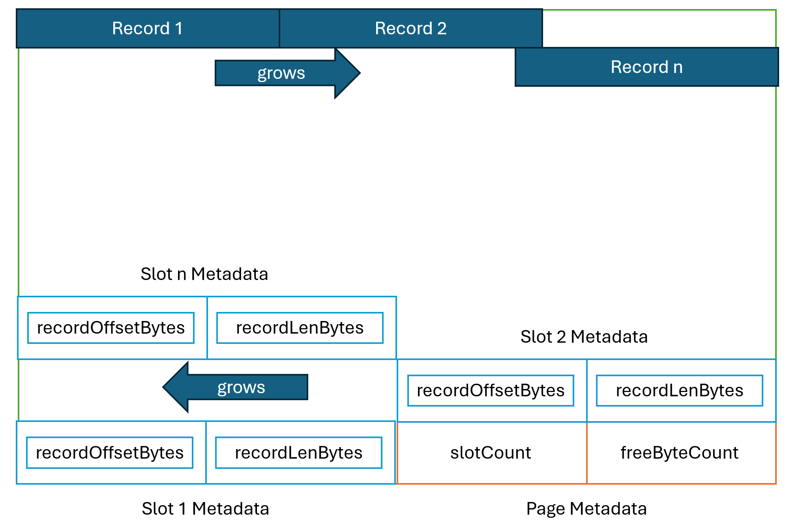

## Project 1 Report


### 1. Basic information
 - Team #:
 - Github Repo Link: https://github.com/suhas-bn-1412/cs222-winter24-suhas-bn-1412
 - Student 1 UCI NetID: `snhegde`
 - Student 1 Name: Sujay Narashimamurthy Hegde
 - Student 2 UCI NetID (if applicable): `sbasappa`
 - Student 2 Name (if applicable): Suhas Basappa Nataraj


### 2. Internal Record Format
- Show your record format design.


- Describe how you store a null field.


- Describe how you store a VarChar field.


- Describe how your record design satisfies O(1) field access.


### 3. Page Format
- Show your page format design.



- Explain your slot directory design if applicable.


### 4. Page Management
- Show your algorithm of finding next available-space page when inserting a record.
```
PageNum getNextAvailablePage(record, file) {
    IF file.pageCount = 0:
        Append new page to file
        RETURN 0
    ELSE
        FOR pageNum <- 0 to file.pageCount:
            page <- file.readPage(pageNum)
            IF (page.getFreeByteCount >= record.lengthBytes):
                RETURN pageNum
            END-IF 
        END-FOR
        Append new page to file.
        RETURN (file.pageCount - 1)
        // Pages in a file are zero-indexed
    END-IF
}
```


- How many hidden pages are utilized in your design?
    1 


- Show your hidden page(s) format design if applicable

  | metadataChecksum  | curPagesInFile   |
  |-------------------|------------------|
  | readPageCounter   | writePageCounter |
  | appendPageCounter |                  |  


### 5. Implementation Detail
- Other implementation details goes here.


### 6. Member contribution (for team of two)
- Explain how you distribute the workload in team.

  | Component              | Member                                                                                                                                                                 |
    |------------------------|------------------------------------------------------------------------------------------------------------------------------------------------------------------------|
  | PageFileManager        | 1. Suhas - implementation                                                                                                                                              |
  | RecordBasedFileManager | 1. Sujay - File operations, Record management inside a page, Record Insertion into a page, Record read from a page <br/> Suhas - Record Serialization, Deserialization |      


### 7. Other (optional)
- Freely use this section to tell us about things that are related to the project 1, but not related to the other sections (optional)


- Feedback on the project to help improve the project. (optional)