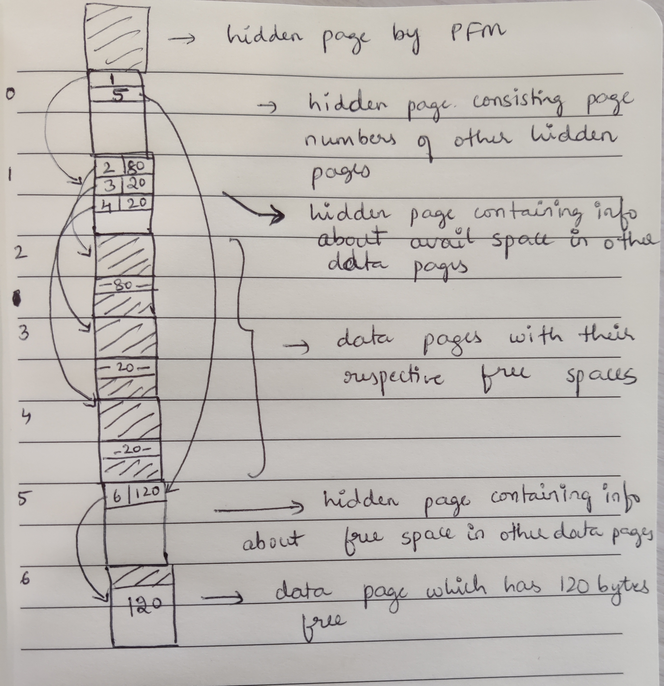

## Project 2 Report


### 1. Basic information
 - Team #: 4
 - Github Repo Link: https://github.com/suhas-bn-1412/cs222-winter24-suhas-bn-1412
 - Student 1 UCI NetID: `snhegde`
 - Student 1 Name: Sujay Narashimamurthy Hegde
 - Student 2 UCI NetID (if applicable): `sbasappa`
 - Student 2 Name (if applicable): Suhas Basappa Nataraj

### 2. Meta-data
- Show your meta-data design (Tables and Columns table) and information about each column.

  * Tables table
```
  =====================================================================
  |    table-id : int    |  table-name : varchar(20)  |  file-name : varchar(20)  |
  =====================================================================
```
     - table-id - primary key in the Tables table. Unique identifier for any Table created in the Database
     - table-name - name of the table, stored as varchar with max char limit of 20
     - file-name - name of the file in which data is stored for this particular table. stored as varchar with mac char limit of 20

  * Columns table 
```
  ============================================================================================================
  |  table-id : int  |  col-name : varchar(50)  |  col-type : int  | col-length : int  |  col-position : int  |
  ============================================================================================================
```
     - table-id - represents the ID of the table for which the attribute belongs to
     - col-name - name of the attribute (table_id, attr_name) together forms unique pairs in this table
     - col-type - enum storing type of the attribute (integer, float or varchar)
     - col-length - length of the attribute. In case of integer and float, length is 4, in case of varchar length is max char limit of varchar
     - col-position - position of the attribute in the schema of the table

### 3. Internal Record Format (in case you have changed from P1, please re-enter here)
- Show your record format design.

  * Record stored in the page
```
  ======================================================
  |  pageNum  |  slotNum  |  isTombstone  |    data    |
  ======================================================
```
     - pageNum, slotNum = pageNum and slotNum of the record - 4 bytes each (in case of tombstone stored the link to next location)
     - isTombstone = boolean - 1 byte - (true if this particular record is a tombstone and contains the link to next location)
     - data - 0 bytes if this is a tombstone, else follows following format


  * data
```
  =============================================================
  |  numFields  |  nullFlags  |  field-offset-dir  |  fileds  |
  =============================================================
```
     - numFields = num of fields present in the record - 4 bytes
     - nullFlags = n bytes (n = math.ceil(numFields / 8)) (follows same format from project 1)
     - field-offset-dir = has #numFields entries representing the offset for each field in the record - 4 * numFields bytes
     - fields = actual data

- Describe how you store a null field.
same as project 1 - store math.ceil(num_attrs/8) bytes to store nullflags
most significant bit represents if the 1st attribute is null


- Describe how you store a VarChar field.
4 bytes to store the length of the varchar value.. if that is n, then next n bytes to store the varchar value


- Describe how your record design satisfies O(1) field access.
  1. Given RID, we check which page and slot the record is present in.
  2. We check in that slot, and get the offset and length of the record.
  3. Since we have offset, we don't have to go through all the records in the page to get to the required record


### 4. Page Format (in case you have changed from P1, please re-enter here)
- Show your page format design.
Not changed from project 1


- Explain your slot directory design if applicable.

  If length of field is present as 0, then that slot is not being used currently.
  After deleting a record, it's slot's length is set to zero, representing that slot can be used for another record insertion


### 5. Page Management (in case you have changed from P1, please re-enter here)
- How many hidden pages are utilized in your design?

  Number of hidden pages are dynamic based on the number of records.

  1 page - to maintain the details about which oages are used to store info about available spaces in all pages
           if this pages has n entries - meaning it represents page numbers of n pages which stores below information

  n hidden pages - stores info about pages storing data and available space in them
                   each page has multiple entries of (page_num - avail_space) data


- Show your hidden page(s) format design if applicable



### 6. Describe the following operation logic.
- Delete a record
  1. Given the RID, check the slot directory of that page.
  2. Mark the slot as unused (by setting slot-length to 0, in the page's slot directory, and shift the offset to the left for all slots which are after the current slot
  3. Shift the data to the left for all the subsequent records after the current slot

- Update a record

Given existing RID, and data we do the following

```
if (RID represents a tombstone)
{
        follow till RID is no longer a tombstone
}

newLen = length of new record
oldLen = length of old record

if (newLen < oldLen) {
        update the record at existing RID location
        shift records to left for all records which are to the right of the current record
        update their offsets in slot directory
}
else
{
        if curPage has space
        {
                shift all records to right of the current record to their right by required number of bytes
                update the record at same location
                update offsets in the slots of all the records to the right of the current record
        }
        else
        {
                insert the record as new record to another page
                write that pageNum and slotNum as the records page and slot in current location of the record
                mark the record as tombstone
                erase the data at the current location = shift the records to the left for all records right of the current record
        }
}
```


- Scan on normal records


- Scan on deleted records


- Scan on updated records


### 7. Implementation Detail
- Other implementation details goes here.


### 8. Member contribution (for team of two)
- Explain how you distribute the workload in team.

RBFM

Suhas - RBFM scan and scan iterator, Hidden pages to maintain the available space info for all the pages, RBFM scan iterator

Sujay - RBFM update record, delete record. Tombstone management, and handling tombstones during read


RM

Suhas - creating record descriptor given a table name, insert/delete/update/read tuple, RM scan and RM scan iterator

Sujay - creating catalog files, and writing data into catalog files. create/delete catalog files, create/delete tables 


### 9. Other (optional)
- Freely use this section to tell us about things that are related to the project 1, but not related to the other sections (optional)


- Feedback on the project to help improve the project. (optional)
