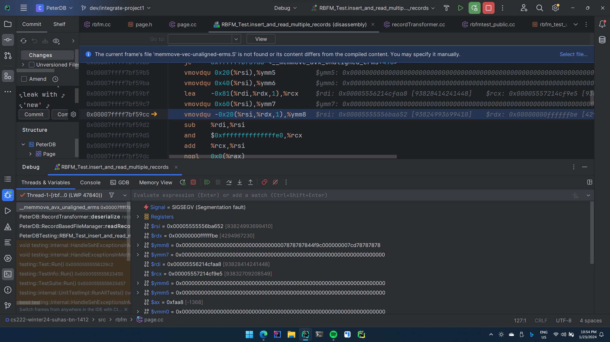
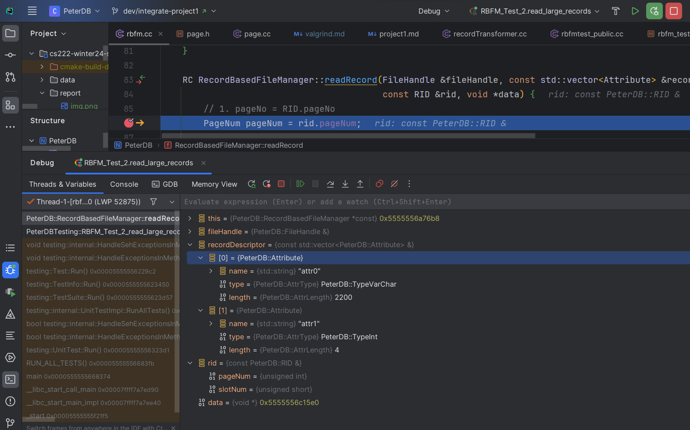
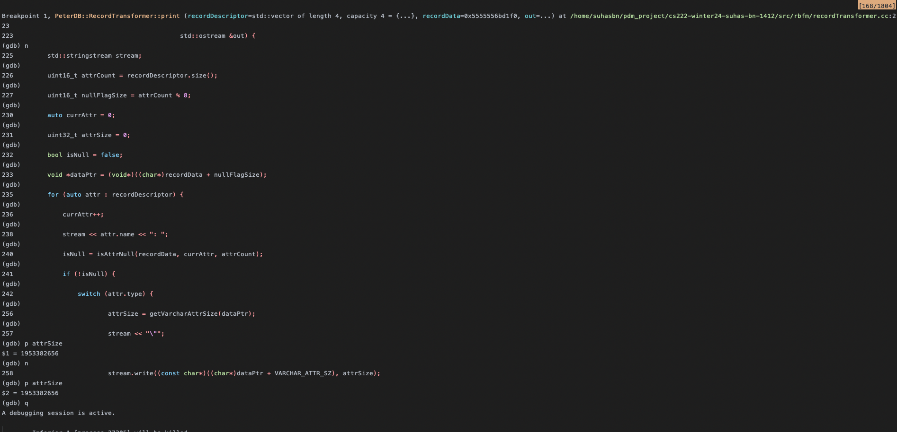
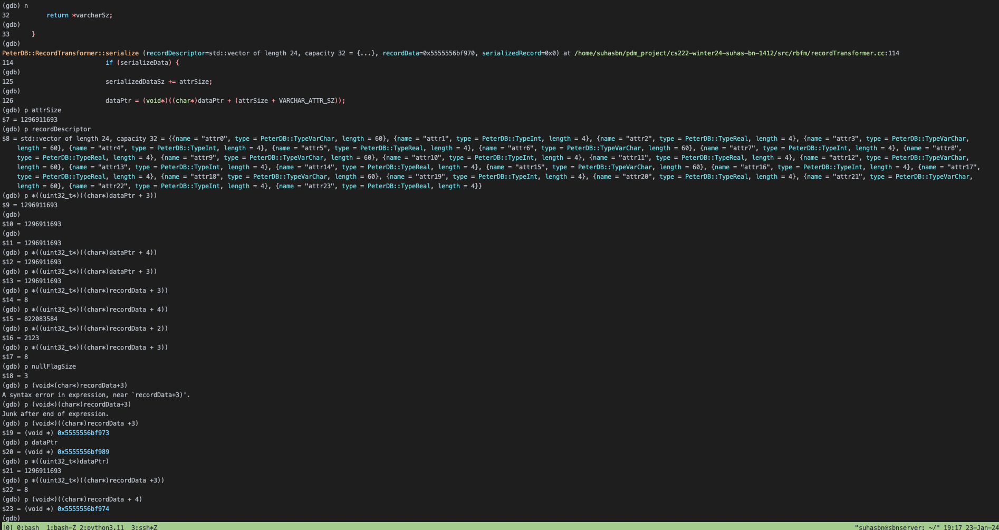
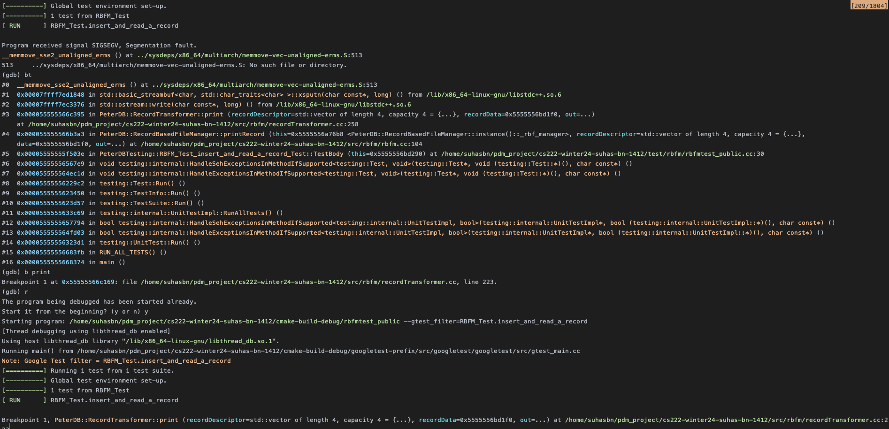
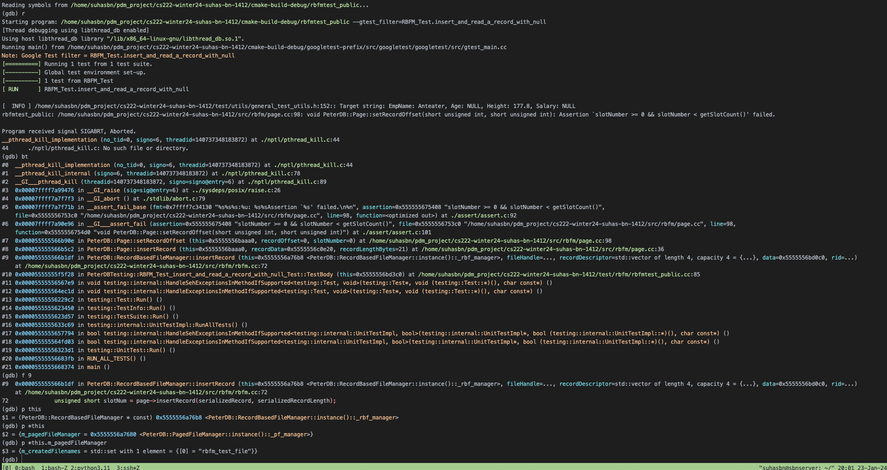
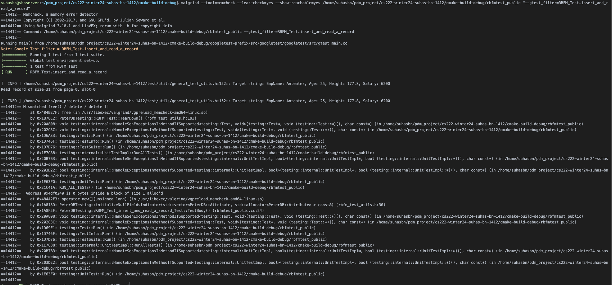
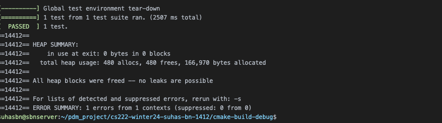

## Debugger and Valgrind Report

### 1. Basic information
- Team #: 4
- Github Repo Link: https://github.com/suhas-bn-1412/cs222-winter24-suhas-bn-1412
- Student 1 UCI NetID: `snhegde`
- Student 1 Name: Sujay Narashimamurthy Hegde
- Student 2 UCI NetID (if applicable): `sbasappa`
- Student 2 Name (if applicable): Suhas Basappa Nataraj

### 2. Using a Debugger
- Describe how you use a debugger (gdb, or lldb, or CLion debugger) to debug your code and show screenshots. 
- 
    We used a debugger to pinpoint the source of segmentation faults, evaluate expressions and the values of variables on the stack

### 3. Using Valgrind

- Describe how you use Valgrind to detect memory leaks and other problems in your code and show screenshot of the Valgrind report.
-
    We used valgrind to check where memory leak was happening. Even though test cases were passing there were memory leaks.
    This helped us fix memory leaks which were causing other test cases to fail

